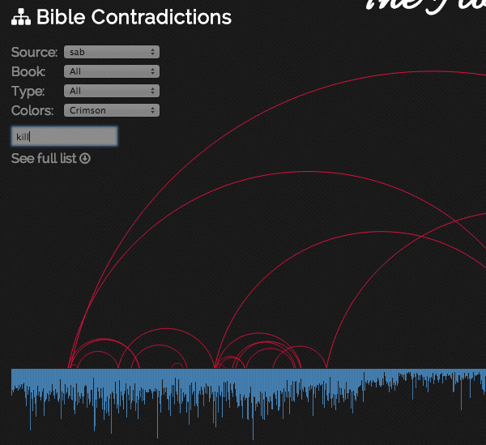
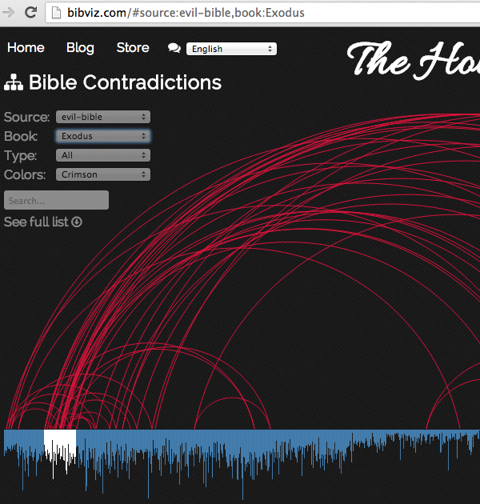

Bible Contradiction Search
==========================
It's now possible to filter contradictions with a text search right on the main BibViz Project homepage. This works for any supported data set and filters items in real-time as you type:

Also included with these updates are how URLs are handled. A new URL hash processor is included that updates the page hash and reads it on page load, allowing you to set filters and save the page to share with a friend. For example, the URL to show all contradictions from the EvilBible.com data set that touch the book Exodus, the URL would contain `#source:evil-bible,book:Exodus`.

Hopefully this makes it easier to share and directly link to contradiction chart data!
