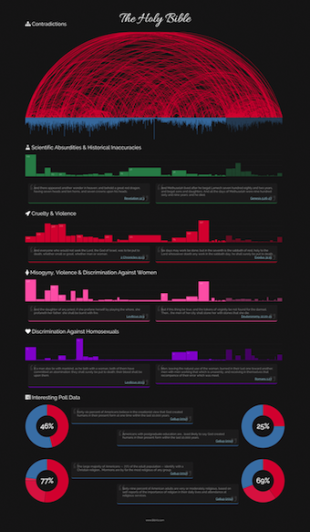
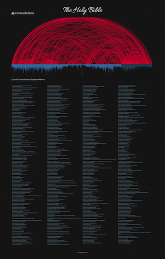

Bible Contradictions Posters
============================
Many BibViz.com visitors have been asking for larger printable versions of the site. Today I'm proud to announce that two posters have gone on sale in the [BibViz store](http://www.zazzle.com/bibviz*)! The first shows the infographics from the main BibViz page, while the second shows just the contradictions chart and table of contradiction information.

Both posters include a link to the BibViz.com website, where the infographics can be interactively explored.

<div class="left" style="margin-right: 12px;">
[](http://www.zazzle.com/bible_contradictions_poster_14_x_24-228921555189929759)
</div>
<div class="left">
[](http://www.zazzle.com/bible_contradictions_poster_14_x_22-228252201328757395)
</div>
<div class="clear"></div>

Each sale of the posters benefits BibViz.com, helping to cover the costs of hosting, server management and new development.

If you have a printer capable of printing posters and would like to print one yourself, you can do so by generating the poster image file with [PhantomJS](http://phantomjs.org/) and [rasterize.js](https://github.com/ariya/phantomjs/blob/master/examples/rasterize.js). Please make sure that your PhantomJS build supports WebFonts, then run the following:

```bash
phantomjs rasterize.js http://bibviz.com/poster.html poster.png null 2
```

If you decide to print your own poster, please consider [donating a few dollars to BibViz](https://spb.io/0rgLYyRkJK).
