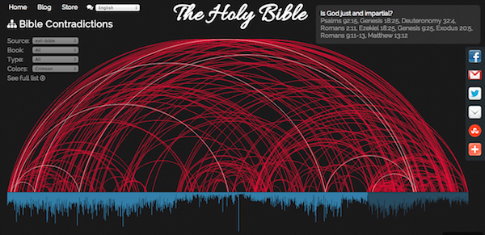
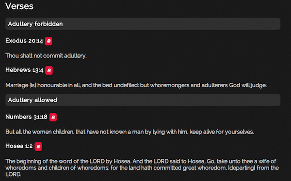

EvilBible.com Data Set
======================
BibViz now supports displaying data from the list of contradictions on [EvilBible.com](http://www.evilbible.com/Biblical%20Contradictions.htm) as part of the ongoing [support of multiple data sets](/blog/multiple-source-data-sets/). The source contains 141 contradictions and provides another unique perspective on the issues of the Bible.

Along with support for the EvilBible data set, BibViz now supports annotations for individual verse data. Currently this means things like grouping verses, for example in the image below verses are grouped by whether they support or condemn adultery:

In the future other annotations can be used to help with filtering data. One that is planned is to mark the severity of contradiction, so that it becomes easier to view only the most severe issues and filter out the minor ones.

Expect to see annotated verse support in the Skeptic's Annotated Bible and Infidels.org data sets in the near future.
