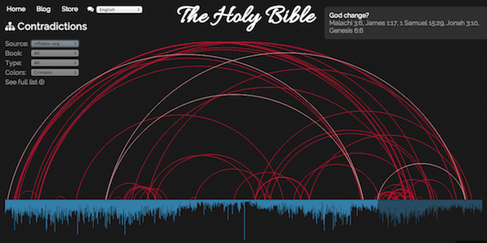
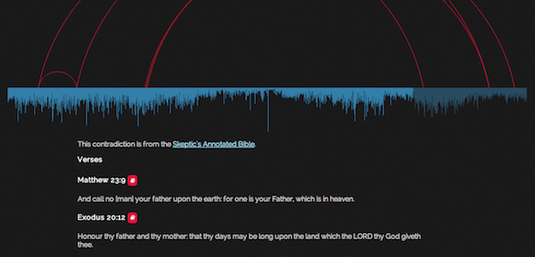
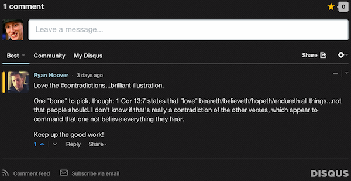

Multiple Source Data Sets
=========================
BibViz now supports displaying data from multiple source data sets. Currently supported are both the Skeptic's Annotated Bible (sab) and the list of contradictions from Infidels.org. This change is in response to the critiques about the choice of source for the data to display on BibViz. Giving you a choice of source means that you no longer need to rely on just one party for potential contradictions. It also opens up the ability to do meta-analysis of the varying datasets to determine common themes.

The source data defaults to the Skeptic's Annotated Bible, but can be changed via the __Source__ selector in the contradiction chart filters.

Along with multiple sources come some other changes to the site. First, clicking on a contradiction now gives you a page with individual Bible verses as well as quick buttons for context in the three most popular versions (Authorized King James Version, New International Version, New Living Translation) and a link back to the original site which contains the contradiction. This means that you get a consistent interface for all source data sets, and it's much easier to debate the context of a particular verse.

Along with those changes is another big one: user comments. Each individual contradiction page now has a place for you to leave comments, and those voted best will be displayed first.

Because the majority of changes required to support multiple data sets is now complete, adding additional sources is relatively easy. Expect to see more in the future, and if you have any suggestions please add them in the comments below!
